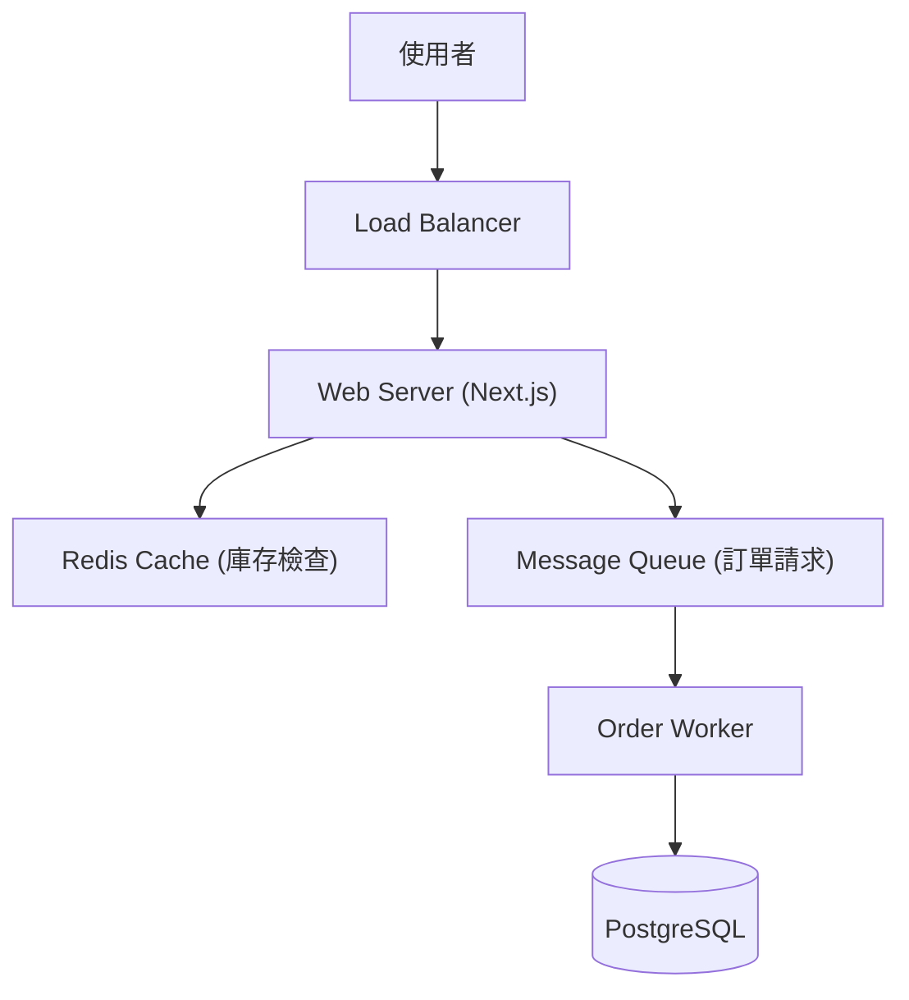

# 實戰操作：系統架構規劃 (System Architecture)

## 情境
你正在設計一個複雜的系統（例如電商網站或桌面應用程式），需要定義前後端架構、資料流向以及模組關係。

---

## Antigravity 做法 (Agentic Workflow)

### 1. 下達指令
你可以要求 Agent 擔任架構師的角色，甚至請它畫圖：

> "請幫我設計一個『高流量售票系統』的系統架構。
> 1. 說明前端、後端、資料庫與快取層的選型。
> 2. 使用 Mermaid 語法繪製系統架構圖，展示使用者請求如何經過 Load Balancer 到達系統。
> 3. 針對『搶票瞬間流量』提出解決方案。"

### 2. Agent 執行過程
1.  **架構設計**：Agent 建議使用 Microservices 架構，利用 Redis 處理高併發，並使用 Queue (如 Kafka/RabbitMQ) 來削峰填谷。
2.  **圖表繪製**：直接在 Markdown 文件中生成 Mermaid 圖表代码。
3.  **文件產出**：建立 `architecture.md` 詳細說明設計理念。

---

## 結果範例
Agent 生成的架構圖 (Mermaid)：

🟢 **效益**：
- **視覺化**：透過圖表快速與團隊溝通複雜概念。
- **最佳實踐**：Agent 會根據業界標準（Best Practices）提供建議，補足個人經驗的盲點。
